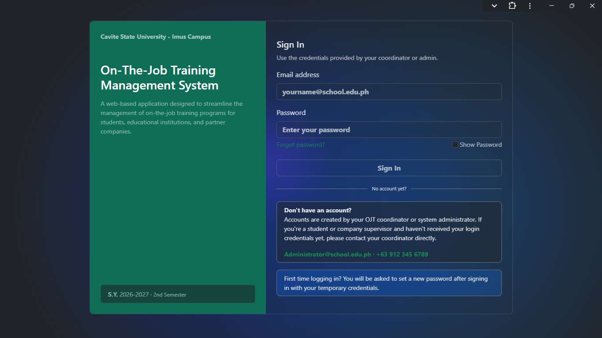
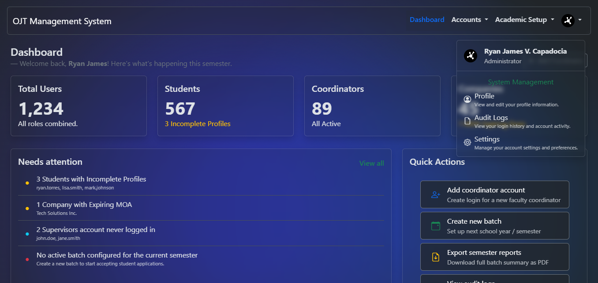
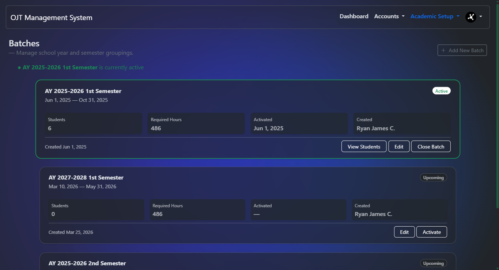
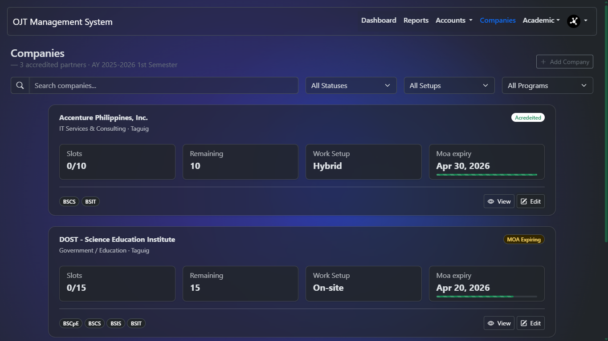
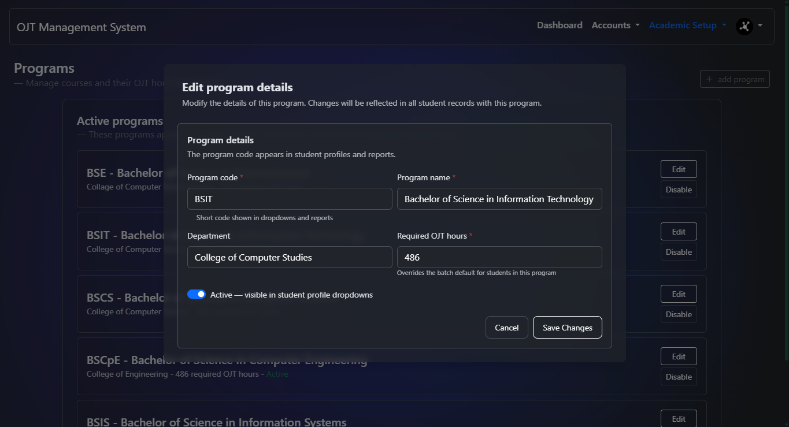
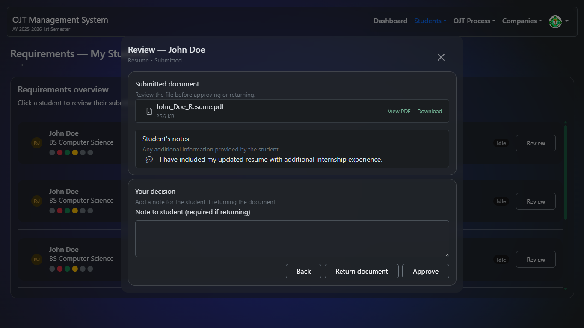
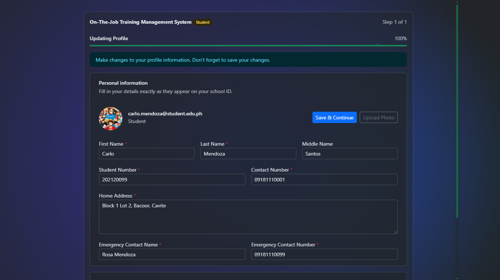
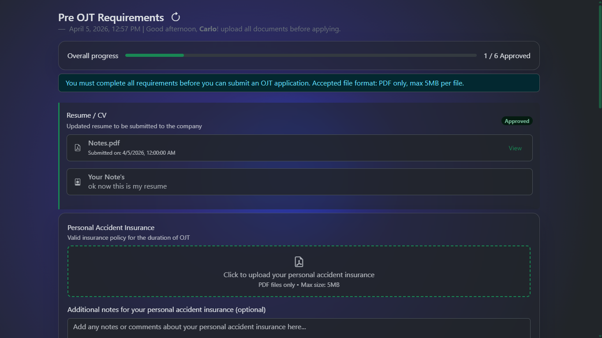

# 🚀 OJT System (Rebuild)

This project is a **rebuild of my previous OJT Coordinator System**, modernized with a cleaner structure, pre-configured libraries, and a smoother setup flow for easier maintenance and future development.

> ℹ️ The repository originally started from a template-style base, but it now serves as the active codebase for the rebuilt OJT system.

---

## ✨ Features

- **Server Status Checker** — `index.html` automatically checks if Apache, MySQL, and your database connection are live before loading the app
- **Pre-bundled Libraries** — all dependencies are included locally in `/libs`, no package manager required
- **Clean Directory Structure** — organized folders for assets, source pages, and libraries
- **Apache Ready** — includes a pre-configured `.htaccess` for URL rewriting and access control

---

## 📝 Recent Updates

> _Last updated: April 2026_

- ✅ Implemented core UI styles, dashboard components, and authentication logic for admin and student modules:
   - Updated Batches management UI and scripts (`Src/Pages/Admin/Batches.php`, `Assets/Script/AdminScripts/batchesSripts.js`, `Assets/api/batch_functions.php`)
   - Enhanced Student Profile and Requirements functionalities (`Src/Components/Header_Students.php`, `Assets/Script/ProfileScripts/StudentProfileScript.js`)
   - Improved login and authentication routing (`Assets/api/loginProcess.php`, `Assets/Script/loginScript.js`)
   - Added core UI styles (`Assets/style/MainStyle.css`)
- ✅ Added **Companies Management module** for admins:
   - `Src/Pages/Admin/Companies.php`
   - `Assets/Script/AdminScripts/CompaniesScripts.js`
   - `Assets/api/company_functions.php`
- ✅ Implemented company lifecycle + assignment support:
   - Create and edit company profiles
   - Manage accreditation status (`pending`, `active`, `expired`, `blacklisted`)
   - Track batch-based OJT slots (total, filled, remaining)
   - Assign accepted programs per company
   - Manage primary contact details
- ✅ Added company document workflow:
   - Upload PDF documents (MOA/NDA/Insurance/BIR/SEC-DTI/Other)
   - MOA validity tracking with expiring/expired indicators
   - Auto-promote company status from `pending` to `active` after MOA upload
   - Role-protected viewing/serving via `file_serve.php`
   - Strict access control ensures only authorized users can access sensitive company documents
   - `file_serve.php?company_uuid=xxx&action=inline` for inline viewing (new tab)
   - `file_serve.php?company_uuid=xxx&action=download` for forced download
- ✅ Added **Programs Management module** for admins:
   - `Src/Pages/Admin/Programs.php`
   - `Assets/Script/AdminScripts/ProgramsScripts.js`
   - `Assets/api/program_functions.php`
- ✅ Implemented full program lifecycle actions:
   - Create program
   - Edit program details
   - Disable/enable program status
   - Fetch all programs for UI rendering
- ✅ Added program-level required OJT hours support (`getProgramHours()`), allowing overrides from batch default hours
- ✅ Added audit trail entries for program actions (`program_create`, `program_update`, `program_toggle`)
- ✅ Confirmed role-specific pages currently present in the project:
   - Coordinator: `Src/Pages/Coordinator/CoordinatorDashboard.php`, `Coordinator_Profile.php`, `viewProfile.php`
   - Students: `Src/Pages/Students/StudentsDashboard.php`, `Students_Profile.php`
   - Supervisor: `Src/Pages/Supervisor/SupervisorDashboard.php`, `Supervisor_Profile.php`
- ✅ Added and wired **Coordinator module** components:
    - Dashboard page + script:
       - `Src/Pages/Coordinator/CoordinatorDashboard.php`
       - `Assets/Script/DashboardScripts/CoordinatorDashboardScript.js`
    - Profile and view-profile pages + scripts:
       - `Src/Pages/Coordinator/Coordinator_Profile.php`
       - `Src/Pages/Coordinator/viewProfile.php`
       - `Assets/Script/ProfileScripts/CoordinatorProfileScript.js`
       - `Assets/Script/ProfileScripts/CoordinatorViewProfileScript.js`
    - Coordinator API endpoints:
       - `Assets/api/coordinator_dashboard_queries.php`
       - `Assets/api/coordinator_profile_functions.php`
       - `Assets/api/SaveProfile_Coordinator.php`
- ✅ Added **Requirements review and submission modules**:
   - Coordinator side:
      - `Src/Pages/Coordinator/Requirements.php`
      - `Assets/Script/CoordinatorScripts/RequirementsScripts.js`
      - Review workflow for submitted student documents with approve/return actions
   - Student side:
      - `Src/Pages/Students/Requirements.php`
      - `Assets/Script/StudentsScripts/RequirementsScripts.js`
      - `Assets/api/requirements_functions.php`
      - Requirement upload/review flow for resume and pre-OJT documents
- ✅ Added student profile setup and save endpoints:
   - `Src/Pages/Students/Students_Profile.php`
   - `Assets/Script/ProfileScripts/StudentProfileScript.js`
   - `Assets/api/saveProfile_Students.php`
- ✅ Updated README feature/backend notes to reflect current repository state

---

### BREAKING CHANGE: initial system setup with auth, user management, and academic modules

### Database & Schema

- Configured for MariaDB using `utf8mb4` connection settings via `Assets/database/dbconfig.php`
- Uses a dual-ID approach in the app layer: numeric internal IDs + UUIDs for public references (UUID generation is handled in PHP)
- Core role model supports `admin`, `coordinator`, `student`, and `supervisor`
- Role profile flow is implemented with dedicated profile pages:
   - `Src/Pages/Admin/Admin_Profile.php`
   - `Src/Pages/Coordinator/Coordinator_Profile.php`
   - `Src/Pages/Students/Students_Profile.php`
   - `Src/Pages/Supervisor/Supervisor_Profile.php`
- Audit/auth tracking integrations are present in API layer:
   - `Assets/api/logs.php` (`auditLog()`, `loginAudit()`)
   - `Assets/api/admin_dashboard_queries.php` (activity + alerts feed)
- Batch management is implemented with status transitions and actor tracking in:
   - `Assets/api/batch_functions.php`
- Development/testing data assumptions are supported by dashboard/batch queries, while seed SQL files are maintained outside this repository

### Authentication

- Login UI and no-registration messaging are implemented in `Src/Pages/Login.php`
- Post-login routing chain is implemented in `Assets/api/loginProcess.php`:
   - `must_change_password` → password change screen
   - missing profile → role profile page
   - complete profile → role dashboard
- Forgot password request and reset UX states are implemented in `Src/Pages/ForgotPassword.php`
- Change password supports forced + voluntary modes in:
   - `Src/Pages/ChangePassword.php`
   - `Assets/api/ChangePasswordProcess.php`
- Password hashing uses `password_hash()` (bcrypt-compatible default in PHP)

### User Interface

- Login page includes no-registration notice and first-login guidance (`Src/Pages/Login.php`)
- Profile setup forms exist for all 4 roles (see profile pages above)
- Role dashboards currently available:
   - `Src/Pages/Coordinator/CoordinatorDashboard.php`
   - `Src/Pages/Students/StudentsDashboard.php`
   - `Src/Pages/Supervisor/SupervisorDashboard.php`
   - `Src/Pages/Coordinator/viewProfile.php`
- Requirements pages are available for:
   - `Src/Pages/Coordinator/Requirements.php`
   - `Src/Pages/Students/Requirements.php`
- Coordinator module UI now includes:
   - Coordinator dashboard summary cards and action panels
   - Coordinator profile update flow
   - Coordinator read-only profile view page
   - Coordinator student requirements review page
- Student module UI now includes:
   - Student dashboard with greeting panel
   - Student profile setup/update flow
   - Student pre-OJT requirements submission page
- Admin dashboard with stat cards/activity/alerts is implemented in:
   - `Src/Pages/Admin/AdminDashboard.php`
   - `Assets/api/admin_dashboard_queries.php`
- Admin navigation and shared layout are handled through reusable components:
   - `Src/Components/Header.php`
   - `Src/Components/lvl1cards.php`
   - `Src/Components/lvl2cards.php`
   - `Src/Components/lvl3cards.php`
- Forgot password screens include request, sent, reset, expired, and success states (`Src/Pages/ForgotPassword.php`)
- Change password screens include forced and voluntary variants with strength checks (`Src/Pages/ChangePassword.php`)
- Batches module UI is implemented in `Src/Pages/Admin/Batches.php` with:
   - Active batch highlighting and status pills
   - Create/edit batch forms with school-year validation hints and activate toggle
   - Activate confirmation modal (with active-batch close warning)
   - Close confirmation modal (with `CLOSE` typed safety check)
- Companies module UI is implemented in `Src/Pages/Admin/Companies.php` with:
   - Search + filters (status, work setup, accepted program)
   - Company cards showing slots, MOA expiry, accreditation state, and accepted programs
   - Create/edit modals for company details, slot configuration, accepted programs, and contact person
   - Company detail modal with slot summary, contact info, and uploaded document list
   - Document upload modal with PDF validation and MOA date-range fields
- Programs module UI is implemented in `Src/Pages/Admin/Programs.php` with:
   - Program listing cards showing code, name, department, required hours, and status
   - Create/edit program modals with validation for required OJT hours
   - Safe disable flow with randomized confirmation keyword
   - One-click re-enable flow for inactive programs

### Backend Functions (MySQLi)

- Dashboard API (`Assets/api/admin_dashboard_queries.php`):
   - `getDashboardData()`
   - `getStatCards()`
   - `getUsersByRole()`
   - `getRecentAccounts()`
   - `getRecentActivity()`
   - `getNeedsAttention()`
   - `timeAgo()`
- Batch API (`Assets/api/batch_functions.php`):
   - `createBatch()`, `updateBatch()`, `activateBatch()`, `closeBatch()`
   - `getAllBatches()`, `getActiveBatch()`
   - `generateUuid()` for UUID generation in MariaDB-compatible flow
- Program API (`Assets/api/program_functions.php`):
   - `createProgram()`, `editProgram()`, `toggleProgram()`
   - `getAllPrograms()`, `getProgramHours()`
- Company API (`Assets/api/company_functions.php`):
   - `createCompany()`, `updateCompany()`, `getAllCompanies()`, `getCompany()`
   - `addCompanyContact()`, `setCompanySlots()`, `setAcceptedPrograms()`
   - `uploadCompanyDocument()`, `getAvailableCompanies()`, `getExpiringMoas()`
   - `getAllPrograms()`, `getCompanyStatuses()`, `companyWorkSetup()`, `activebatch()`
- Logging helpers (`Assets/api/logs.php`):
   - `auditLog()`
   - `loginAudit()`
- Coordinator dashboard API (`Assets/api/coordinator_dashboard_queries.php`):
   - `getCoordinatorDashboardData()`
   - `getCoordinatorStats_Dashboard()`
   - `getCoordinatorNeedsAction()`
   - `getCoordinatorStudentsSummary()`
   - `getCoordinatorHoursProgress()`
   - `getCoordinatorCompanies()`
   - `getCoordinatorUpcomingVisits()`
   - `getActiveBatch()`
- Coordinator profile API (`Assets/api/coordinator_profile_functions.php`):
   - `getCoordinatorProfile()`
   - `getCoordinatorStats()`
   - `getCoordinatorStudents()`
   - `updateCoordinatorProfile()`
- Requirements API (`Assets/api/requirements_functions.php`):
   - Student document upload and status tracking
   - Coordinator document review actions
- Student profile API (`Assets/api/saveProfile_Students.php`):
   - `fetch_profile_data`
   - save/update profile data for student accounts

### Current Notes

- UUIDs are generated in PHP before INSERT operations where needed (`generateUuid()` in `batch_functions.php`)
- Single active batch behavior is enforced at application layer through `activateBatch()`
- Program management is now available in:
   - `Src/Pages/Admin/Programs.php`
   - `Assets/api/program_functions.php`
   - `Assets/Script/AdminScripts/ProgramsScripts.js`
- Company management is now available in:
   - `Src/Pages/Admin/Companies.php`
   - `Assets/api/company_functions.php`
   - `Assets/Script/AdminScripts/CompaniesScripts.js`
- Company document streaming/downloading is available via:
   - `file_serve.php` (restricted to authenticated `admin` and `coordinator` roles)
- Coordinator dashboard/profile functionality is implemented with dedicated APIs and scripts:
   - `Assets/api/coordinator_dashboard_queries.php`
   - `Assets/api/coordinator_profile_functions.php`
   - `Assets/Script/DashboardScripts/CoordinatorDashboardScript.js`
   - `Assets/Script/ProfileScripts/CoordinatorProfileScript.js`
   - `Assets/Script/ProfileScripts/CoordinatorViewProfileScript.js`
- Coordinator requirements review and student requirements submission are implemented through:
   - `Src/Pages/Coordinator/Requirements.php`
   - `Src/Pages/Students/Requirements.php`
   - `Assets/api/requirements_functions.php`
- Student profile setup is implemented through:
   - `Src/Pages/Students/Students_Profile.php`
   - `Assets/api/saveProfile_Students.php`
   - `Assets/Script/ProfileScripts/StudentProfileScript.js`
- Some advanced company/MOA alert criteria in `getNeedsAttention()` are still placeholder-level and will improve as more workflow/table integrations land
- Dashboard recent activity and needs-attention feeds currently lean on login audits and batch status, and will expand to include company MOA expirations, program changes, and similar events as those pieces are completed
- Next implementation focus is coordinator student management beyond requirements review, including student account creation, a student list page, and editing student profiles.

---
## 🔐 Secure Document Serving

### Why `file_serve.php`?

Company documents (MOA, NDA, insurance certificates, etc.) contain sensitive business information that should never be directly accessible via static URLs. `file_serve.php` acts as a **gatekeeper**, enforcing consistent security checks before any document is served.

**Key Benefits:**
- **Authentication Required** — only logged-in users can access documents
- **Role-Based Access Control** — restricted to `admin` and `coordinator` roles
- **Flexible Serving Options** — inline viewing or forced downloads
- **Audit Trail** — all access attempts are logged for compliance
- **Hidden Storage** — actual files are stored outside the web root, preventing direct URL bypassing

### How It Works

The script validates the request based on two parameters:
- **`company_uuid`** — identifies which company's document to retrieve
- **`action`** — determines how to serve the file (`inline` for viewing in browser, `download` for direct file download)

Example usage:
```
file_serve.php?company_uuid=550e8400-e29b-41d4-a716-446655440000&action=inline
file_serve.php?company_uuid=550e8400-e29b-41d4-a716-446655440000&action=download
```

Access is automatically logged for security auditing.

---


## 🧰 Tech Stack

| Technology | Purpose |
|---|---|
| **PHP** | Server-side scripting & database connectivity |
| **HTML5** | Page structure & markup |
| **JavaScript** | Client-side logic |
| **jQuery** | DOM manipulation & AJAX |
| **Bootstrap** | Responsive UI components & grid layout |
| **Anime.js** | Smooth JavaScript animations |
| **AOS** (Animate On Scroll) | Scroll-triggered animations |
| **Driver.js** | Interactive user onboarding / guided tours |
| **SweetAlert2** | Beautiful, customizable alert dialogs |

---

## 📁 Directory Structure

```
Ojt-system/
├── Assets/
│   └── database/
│       └── dbconfig.php    # Database connection configuration
│   └── Images/            # All image assets (previews, icons, etc.)
│   └── Script/            # JavaScript files organized by page/module
├── Src/
|   └── Components/         # Reusable PHP components (headers, cards, etc.)
│   └── Pages/              # PHP/HTML page files
├── Uploads/              # Uploaded files (company documents, etc.)
├── libs/                   # All bundled front-end libraries (offline-ready)
│   └── composer/           # Optional: PHPMailer & Ratchet (via Composer)
├── index.html              # Entry point with server status checking
├── file_serve.php          # Secure file serving endpoint for company documents
├── .htaccess               # Apache configuration (URL rewriting, access rules)
├── InstallDependencies.md  # Guide for setting up server dependencies
└── LICENSE                 # MIT License
```

---

## ⚙️ Requirements

- **Apache** web server (with `mod_rewrite` enabled)
- **MySQL** / MariaDB
- **PHP** 7.4 or higher
- A local dev environment such as [XAMPP](https://www.apachefriends.org/), [WAMP](https://www.wampserver.com/), [LAMP](https://ubuntu.com/server/docs/lamp-applications), or [Laragon](https://laragon.org/)

---

## 🔁 Enabling mod_rewrite

`mod_rewrite` is required for the `.htaccess` URL rewriting rules to work. Here's how to enable it on common setups:

### XAMPP (Windows)
1. Open `C:/xampp/apache/conf/httpd.conf`
2. Find and uncomment this line (remove the `#`):
   ```
   #LoadModule rewrite_module modules/mod_rewrite.so
   ```
3. Find `AllowOverride None` under your `<Directory>` block and change it to:
   ```
   AllowOverride All
   ```
4. Save the file and restart Apache from the XAMPP Control Panel

### WAMP (Windows)
1. Left-click the WAMP tray icon → **Apache** → **Apache Modules**
2. Find and click **rewrite_module** to enable it (a checkmark will appear)
3. WAMP will restart Apache automatically

### Linux / LAMP (Ubuntu)
Run the following commands in your terminal:
```bash
sudo a2enmod rewrite
sudo systemctl restart apache2
```
Then make sure your site config (usually `/etc/apache2/sites-available/000-default.conf`) has:
```
AllowOverride All
```

### Laragon (Windows)
`mod_rewrite` is enabled by default in Laragon — no extra steps needed.

---

## 🛠️ Getting Started

### 1. Clone the Repository

```bash
git clone <your-repository-url>
cd Ojt-system
```

### 2. Place in Your Web Server Root

Copy the project folder into your server's document root:

- **XAMPP:** `C:/xampp/htdocs/`
- **WAMP:** `C:/wamp64/www/`
- **Linux/LAMP:** `/var/www/html/`

### 3. Configure Your Database

Update the database connection settings in:

```
Assets/database/dbconfig.php
```

Set your database host, name, username, and password here before running the project.

### 4. Start Your Server

Make sure **Apache** and **MySQL** are running, then navigate to:

```
http://localhost/Ojt-system/
```

### 5. How It Works — Server Check & Redirect

<div align="center">
  
</div>

When a user visits the site, `index.html` acts as a **pre-flight gate** before anything else loads:

- **All checks pass** → the user is automatically redirected to your main page or web app
- **Any check fails** → the page displays a clear status indicator showing which service is down, preventing the app from loading in a broken state

This ensures users and developers always know the server environment is healthy before the application runs.

---

## 🖼️ Screenshots / GIFs (Placeholders)


### Login Flow


### Admin Dashboard


### Batches Management


### Companies Management


### Programs Management


### Requirements Review


### Student Profile Setup


### Requirements Submission

---

## 🔧 Optional Add-ons

These are not required to run the core system but are available if your project needs them. Both are set up via Composer and their packages are located in `libs/composer/`.

### 📧 PHPMailer — Email Support

Adds the ability to send emails from your PHP application (contact forms, notifications, password resets, etc.).

> 📖 See [`InstallDependencies.md`](InstallDependencies.md) for full installation instructions.

**Folder:** `libs/composer/`

---

### 🔌 Ratchet — WebSocket Support

Adds real-time, two-way communication between the server and clients using WebSockets. Great for live chat, notifications, or any feature that needs a persistent connection.

> 📖 See [`InstallDependencies.md`](InstallDependencies.md) for full installation instructions.

**Folder:** `libs/composer/`

---

## 📦 Included Libraries (in `/libs`)

All libraries are bundled locally — no CDN or internet connection required:

- [Bootstrap](https://getbootstrap.com/)
- [jQuery](https://jquery.com/)
- [Anime.js](https://animejs.com/)
- [AOS – Animate On Scroll](https://michalsnik.github.io/aos/)
- [Driver.js](https://driverjs.com/)
- [SweetAlert2](https://sweetalert2.github.io/)
- [Quill 2.0](https://quilljs.com/)

---

## 📄 License

This project is licensed under the [MIT License](LICENSE).

---

## 🤝 Contributing

Pull requests are welcome! If you'd like to suggest improvements or add features, feel free to fork the repo and open a PR.

---

## 🔗 Live Demo

_To be updated for the rebuilt OJT System._
