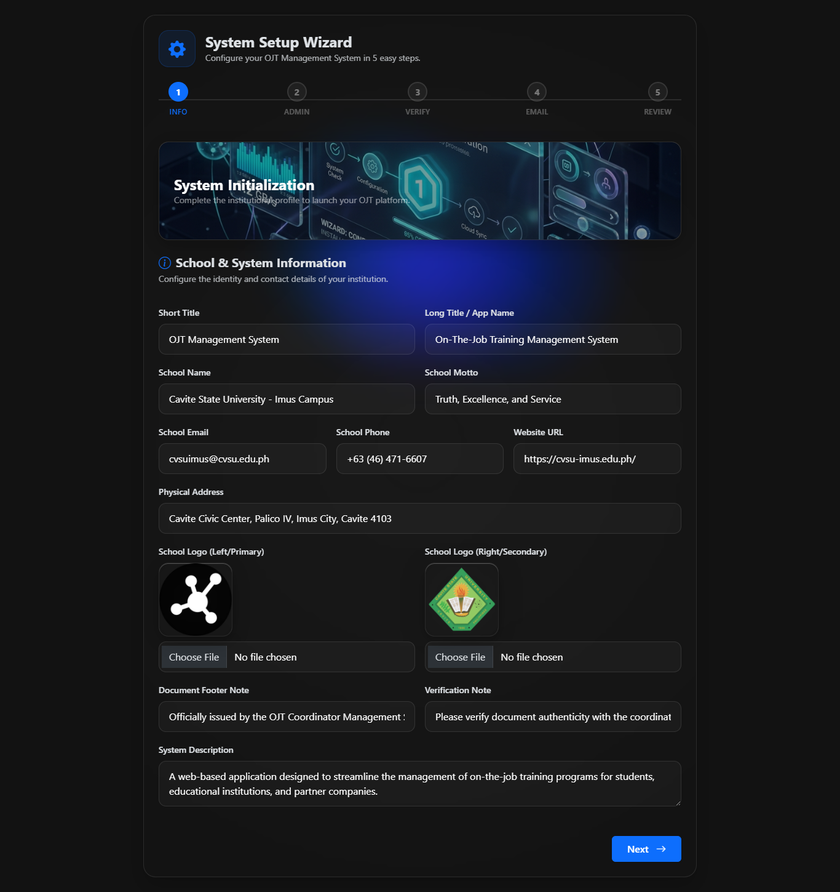
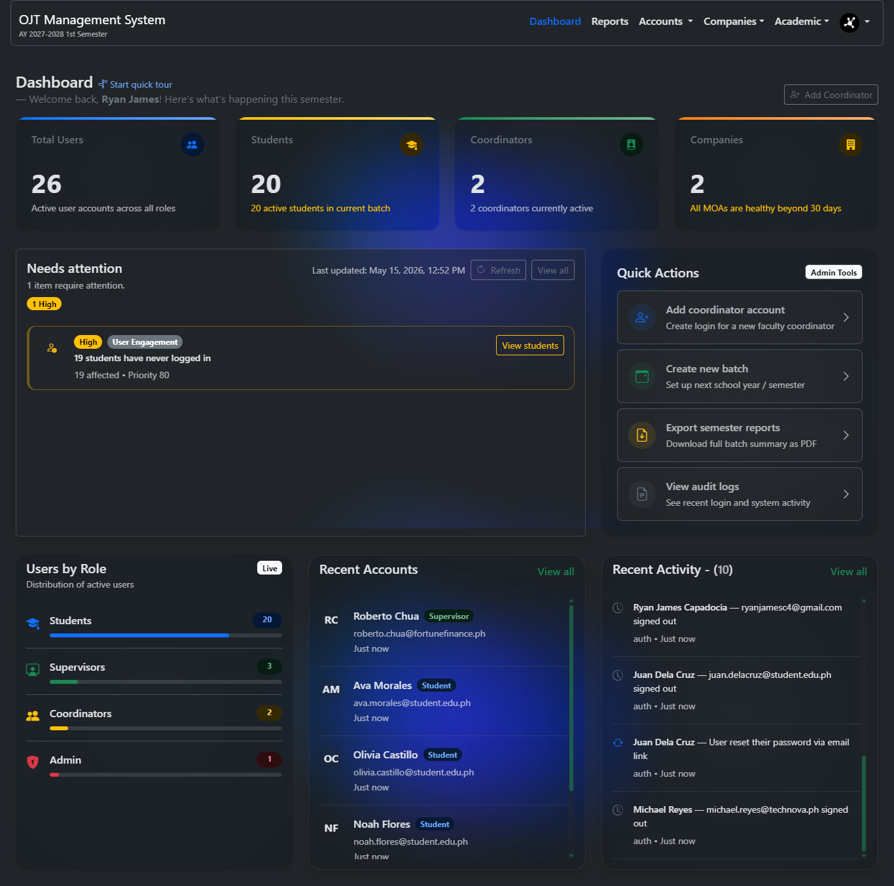
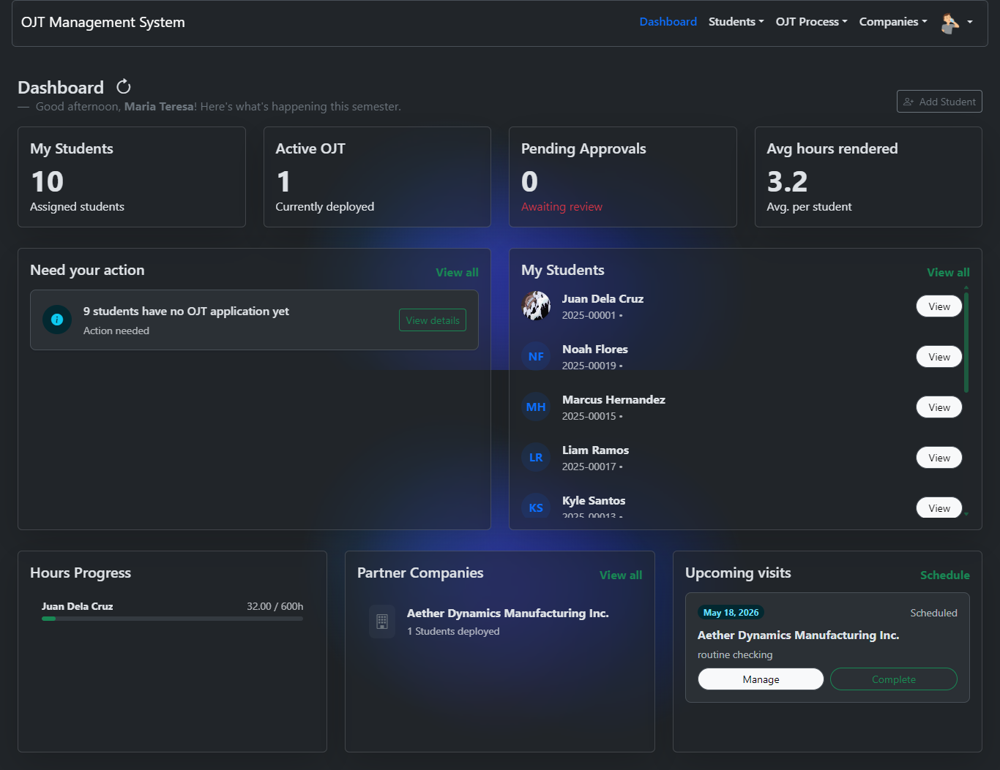
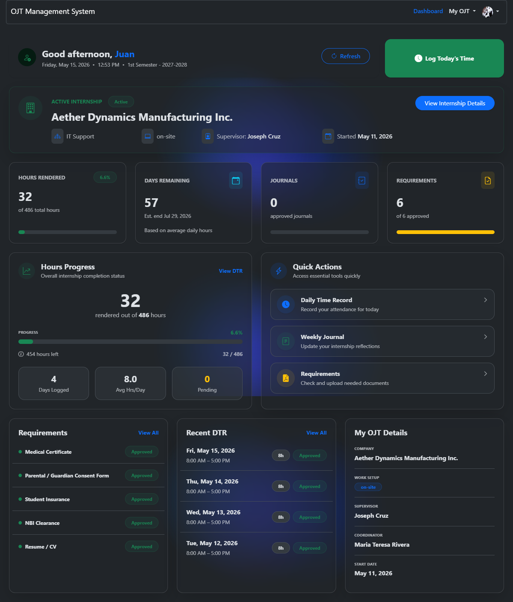
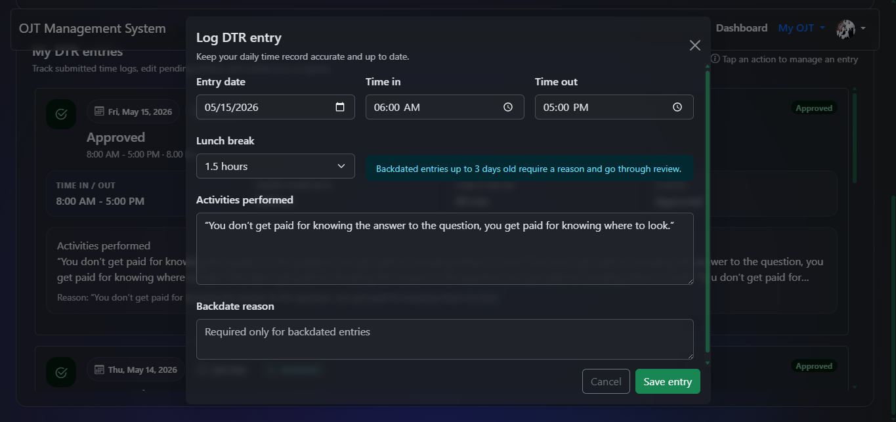
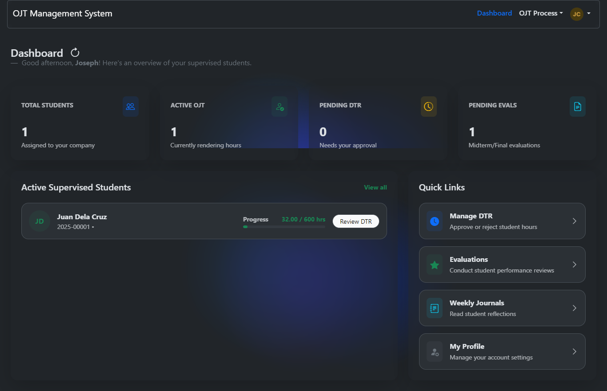

# OJT Management System

A comprehensive, web-based On-the-Job Training management platform built specifically for academic institutions in the Philippines. The system handles the complete OJT lifecycle—from student pre-requirements submission and company accreditation, to daily DTR tracking, evaluations, and final grade computation—all under one unified roof.

Featuring a modern, high-performance "Liquid Glass" UI, the system is designed to be intuitive, responsive, and secure.

> **Status:** Final Release (v1.0)

## 💡 System Highlights

- **Paperless Workflow**: Eliminate physical forms. All requirements, MOAs, evaluations, and daily time records (DTRs) are digitized, submitted, and approved online.
- **Secure Architecture**: Built with a guarded file-serving mechanism and strict role-based access controls to ensure sensitive academic and corporate data remains confidential.
- **Automated Digital Credentials**: Instantly generate and download secure, PDF-based login credentials for your institutional partners and faculty members.
- **Institutional Branding**: The built-in setup wizard allows you to customize the system's logos, application name, and official contact information to reflect your school's unique identity.
- **Real-Time Progress Tracking**: Coordinators and students can monitor training hours, weekly journals, and milestone evaluations at a glance through dedicated, interactive dashboards.

---

## 📸 System Preview

Here is a glimpse of the OJT Management System in action. *(Screenshots to be added)*

### 1. Automated Setup Wizard

*The intuitive 5-step institutional branding and configuration wizard.*

### 2. Secure Login Portal

*Role-based authentication featuring the Liquid Glass UI.*

### 3. Administrator Dashboard

*Centralized hub for managing batches, programs, companies, and system analytics.*

### 4. Coordinator Workspace

*A dedicated interface for tracking student progress, requirements, and final grading.*

### 5. Student Daily Time Record (DTR)

*Digital logging of daily hours, time-in/time-out, and weekly journal submissions.*

### 6. Supervisor Evaluation

*Streamlined approval of student entries and submission of milestone performance evaluations.*

---

## 🎯 Who this is for

This system is designed for Philippine academic institutions running active OJT programs. If your school manages hundreds of students every semester—coordinating with industry partners, tracking document submissions, monitoring daily hours, and compiling final grades—this platform automates and streamlines that exact workflow.

---

## ✨ Key Features

The platform provides dedicated, focused workspaces tailored to each specific role:

- **Admins** manage institutional settings, academic batches, programs, company accreditations, and overall system security through comprehensive audit logs and analytics.
- **Coordinators** monitor assigned students, approve requirements, review daily DTRs and weekly journals, conduct visits, and compute final grades using a weighted rubric.
- **Students** maintain their profiles, submit pre-OJT documents, log daily time-in/time-out, submit weekly reflections, and track their progress towards the required hours.
- **Supervisors** oversee assigned interns, approve/reject DTR entries, review weekly journals, and submit milestone evaluations (Midterm and Final).

---

## 🛠️ Tech Stack

| Layer | Technologies |
|---|---|
| **Frontend** | HTML5, Vanilla CSS3 (Liquid Glass UI), JavaScript, Bootstrap 5.3, jQuery |
| **Backend** | PHP 7.4+ (MySQLi) |
| **Database** | MySQL / MariaDB |
| **Animations** | Anime.js, AOS (Animate On Scroll) |
| **UX & Utilities** | SweetAlert2, Driver.js, Quill 2.0 |
| **Document/Export** | PHPMailer (SMTP), mPDF (PDF generation), PhpSpreadsheet (Excel) |
| **Deployment** | Traditional Web Hosting / Localhost (XAMPP/WAMP) |

*Note: All frontend libraries are bundled locally inside `/libs`, ensuring the project runs efficiently without depending on external CDNs.*

---

## 🔒 Roles & Permissions

| Feature | Admin | Coordinator | Student | Supervisor |
|---|:---:|:---:|:---:|:---:|
| **Authentication & Account** | | | | |
| Login / logout / password reset | ✅ | ✅ | ✅ | ✅ |
| Setup & edit own profile | ✅ | ✅ | ✅ | ✅ |
| User preferences (Dark/Light mode) | ✅ | ✅ | ✅ | ✅ |
| **System & Admin Management** | | | | |
| System Setup Wizard & Institutional Config | ✅ | ❌ | ❌ | ❌ |
| Manage batches, programs & companies | ✅ | ❌ | ❌ | ❌ |
| Manage coordinator & supervisor accounts | ✅ | ❌ | ❌ | ❌ |
| Bulk student import (CSV/XLSX) | ✅ | ✅ | ❌ | ❌ |
| View system audit logs & analytics | ✅ | ❌ | ❌ | ❌ |
| **Coordinator Workflow** | | | | |
| Manage assigned students | ⚠️ | ✅ | ❌ | ❌ |
| Approve student requirements | ❌ | ✅ | ❌ | ❌ |
| Endorse OJT applications & confirm start | ❌ | ✅ | ❌ | ❌ |
| Monitor DTR, Journals, and Evaluations | ❌ | ✅ | ❌ | ❌ |
| Schedule company visits | ❌ | ✅ | ❌ | ❌ |
| Compute & finalize student grades | ❌ | ✅ | ❌ | ❌ |
| **Student Workflow** | | | | |
| Upload pre-OJT requirements | ❌ | ❌ | ✅ | ❌ |
| Apply to accredited companies | ❌ | ❌ | ✅ | ❌ |
| Log daily DTR & submit weekly journals | ❌ | ❌ | ✅ | ❌ |
| Track hours progress | ❌ | ✅ | ✅ | ✅ |
| **Supervisor Workflow** | | | | |
| Approve / reject DTR entries | ❌ | ❌ | ❌ | ✅ |
| View student weekly journals | ❌ | ❌ | ❌ | ✅ |
| Submit Midterm & Final Evaluations | ❌ | ❌ | ❌ | ✅ |

**Legend:**
✅ Full access | ⚠️ Partial / scoped access | ❌ No access

---

## 🚀 Installation & System Setup

### Prerequisites & Dependencies
Before installing the system, ensure your environment meets the necessary requirements:
- **PHP 7.4+** and **MySQL / MariaDB**
- **Composer** (Required for email, PDF exports, and spreadsheet features)
  
> ⚠️ **Important:** Please read the [Install Dependencies Guide](InstallDependencies.md) to correctly install the required Composer packages (PHPMailer, mPDF, PhpSpreadsheet) into the `libs/composer` directory.

### Deployment
The project can be deployed to any standard PHP-MySQL web hosting environment or run locally using XAMPP/WAMP.

1. Clone or copy the project files to your web server's root directory (e.g., `htdocs` for XAMPP).
2. Install the necessary Composer dependencies as outlined in the [Install Dependencies Guide](InstallDependencies.md).
3. Create a new, empty MySQL database for the project via phpMyAdmin or your MySQL client.
4. Open `config/db.php` and configure your database credentials.

### Automated Setup Wizard
The application features a built-in Setup Wizard that runs automatically upon your first launch. 

1. Navigate to the application URL in your browser (e.g., `http://localhost/ojt-system`).
2. The wizard will automatically guide you through the initial configuration:
   - **Database Generation:** Automatically creates tables and verifies schema integrity.
   - **Administrator Account:** Sets up the master Admin account.
   - **Institutional Branding:** Configures system logos, app name, and official contact information.
   - **SMTP Configuration:** Links your mail server to handle system notifications and password resets.

---

## 📂 Architecture

The project relies on a clean, scalable architecture to separate UI from business logic:

- **`Src/Pages/`**: Role-specific UI pages (Auth, Dashboards, Profile, Settings).
- **`functions/`**: Core backend logic and database transactions.
- **`process/`**: API endpoint handlers that bridge the frontend AJAX calls to the `functions/` layer.
- **`Assets/`**: Contains CSS stylesheets (including the core `Liquid Glass` UI system), modular JavaScript, and system images.
- **`uploads/`**: Secure directory for file uploads, protected against direct access. Files are exclusively streamed through the guarded `file_serve.php` engine.

---

## 🛡️ Security Highlights

- **Guarded File Serving**: Sensitive documents (MOAs, student requirements, medical certificates) are never exposed via static URLs. `file_serve.php` verifies the user's active session, role, and authorization before streaming the file.
- **Process Locking**: DTRs, Journals, and Evaluations are strictly locked until a student reaches the prerequisite status (e.g., active application, minimum required hours).
- **Immutable Grades**: Once a coordinator finalizes a student's grade, the record is cryptographically locked and cannot be altered.
- **Password Hashing**: Uses modern PHP `password_hash()` standards.

---

## 📜 License

[MIT License](LICENSE)

---

## 🤝 Contributing

Contributions, issues, and feature requests are welcome. If you'd like to contribute:

- Fork the repository and create a feature branch (git checkout -b feature/your-feature).
- Make small, focused commits with clear messages.
- Open a pull request describing the change, why it's needed, and any migration or rollout notes.

Please follow the project's coding conventions: prefer small functions in `functions/`, keep UI markup inside `Src/Pages/`, and centralize AJAX endpoints in `process/`.

## 🧰 Developer Setup

1. Install PHP 7.4+ and a web server (XAMPP recommended for local development).
2. Install Composer packages as described in `InstallDependencies.md`.
3. Copy `config/db.php.example` to `config/db.php` and update your DB credentials.
4. Create a blank MySQL database and run the setup wizard by visiting the app URL.

Recommended editor settings:

- Enable UTF-8 file encoding
- Trim trailing whitespace on save
- Use 4-space indent for PHP/JS

## 🔁 About the recent automated comment cleanup

This repository was processed by an automated script that removed code comments across most files while preserving the `libs/` folder. For safety:

- Every file modified by the script has a `.bak` backup in the same directory. To restore a file, rename `filename.php.bak` back to `filename.php` or copy contents back as needed.
- The cleanup may have removed useful inline documentation. If you want comments preserved in specific files or folders, open an issue or submit a PR and include the paths to protect.

## 📝 Changelog (high level)

- v1.0 — Initial public release: core OJT workflows, roles, and export features.
- v1.1 — Maintenance: dependency updates, security hardening, and UI refinements.
- v1.2 — Documentation: README and installer improvements; automated comment cleanup performed (May 15, 2026).

If you'd like a detailed changelog for each release, open an issue and we can add a `CHANGELOG.md`.

## 📫 Support

For bugs, feature requests, or help deploying the system, please open an issue in this repository or contact the maintainer listed in `LICENSE`.

