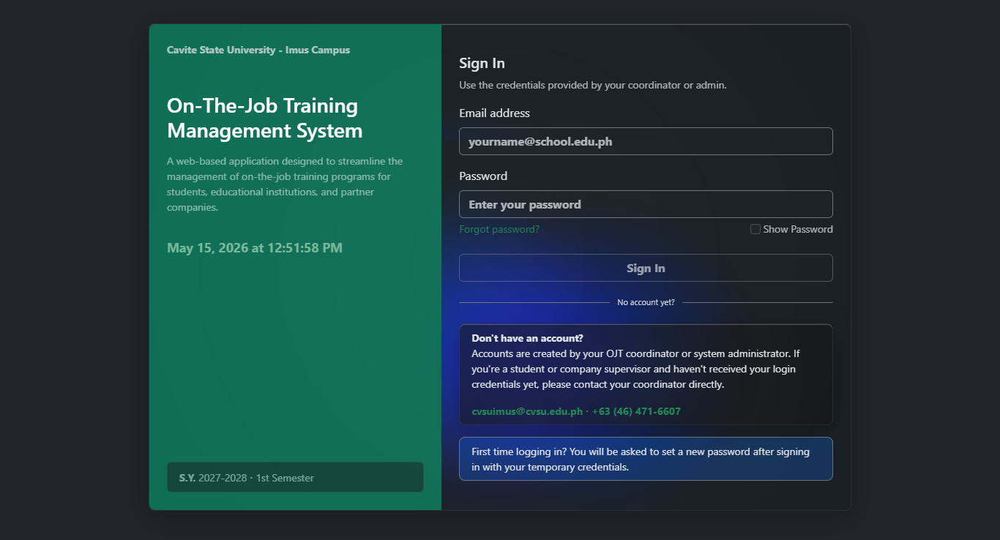
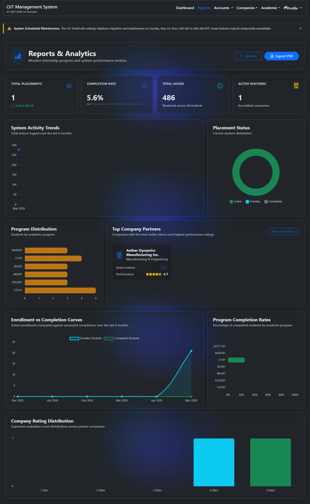
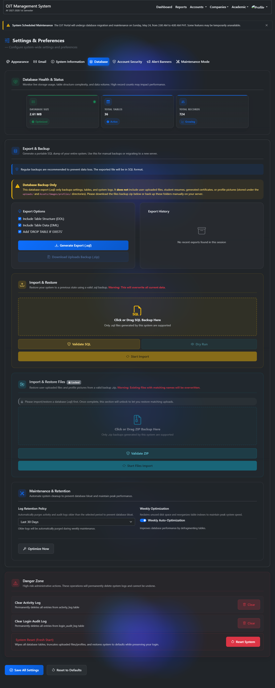
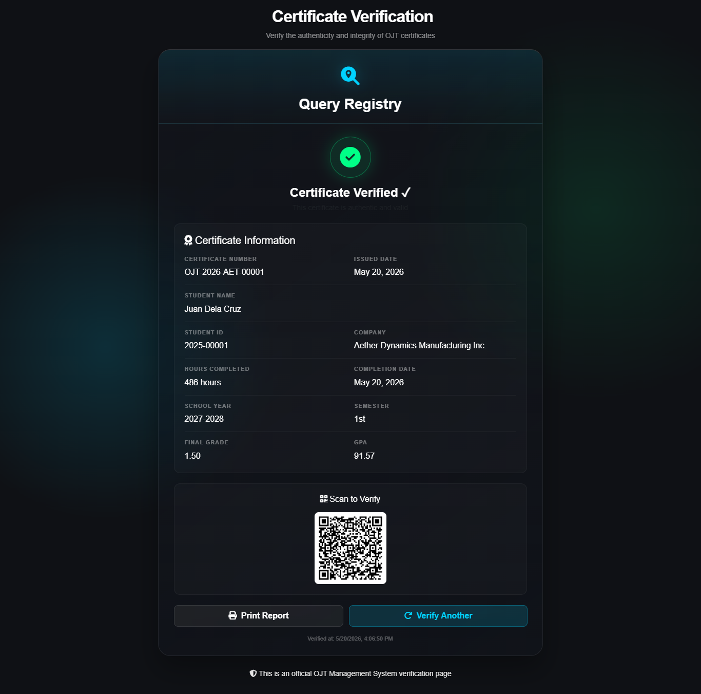
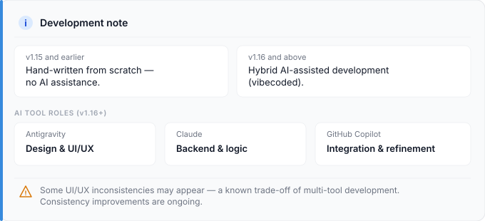

# OJT Management System

A web-based OJT management platform built for Philippine academic institutions. Covers the full cycle — pre-requirements, company accreditation, DTR tracking, evaluations, and grade computation — in one system.

> **Status:** Final Release (v1.20) — This project is no longer actively maintained. It serves as a reference implementation for common OJT management patterns and workflows. Forks and contributions are welcome under the project license.

## 💡 System Highlights

- **Paperless Workflow**: Requirements, MOAs, evaluations, and DTRs are submitted and approved online — no physical forms.
- **Role-Based Access Control**: Strict permission boundaries between Admin, Coordinator, Student, and Supervisor roles. Sensitive data stays where it belongs.
- **PDF Credential Generation**: Generate and download login credentials for institutional partners and faculty on demand.
- **Professional Certificates & Reports**: Generate highly polished, production-ready, landscape A4 certificates and verification print reports with embedded QR codes natively via mPDF.
- **Setup Wizard**: First-launch wizard handles institutional branding — logos, app name, contact info — before anyone else touches the system.
- **Rich Interactive Analytics**: Interactive charts (using Chart.js) visualizing student enrollment/completion curves, program completion rates, company evaluation distributions, weekly attendance patterns, and supervisor skill matrices.
- **Robust Backup & System Recovery**: Backup system files and profile pictures into a `.zip` archive, restore database and files sequentially, and perform secure, multi-tier system resets.

---

## 📸 System Preview

Here is a glimpse of the OJT Management System in action. *(Screenshots to be added)*

### 1. Automated Setup Wizard

*The intuitive 5-step institutional branding and configuration wizard.*

### 2. Secure Login Portal

*Role-based authentication featuring the Liquid Glass UI.*

### 3. Administrator Dashboard

*Centralized hub for managing batches, programs, companies, and system analytics.*

### 4. Coordinator Workspace

*A dedicated interface for tracking student progress, requirements, and final grading.*

### 5. Student Daily Time Record (DTR)

*Digital logging of daily hours, time-in/time-out, and weekly journal submissions.*

### 6. Supervisor Evaluation

*Streamlined approval of student entries and submission of milestone performance evaluations.*

### 7. Interactive Analytics & Reports

*Admin and Coordinator dashboards featuring rich Chart.js visual analytics, enrollment curves, and evaluation radar charts.*

### 8. System Backup, Recovery & Danger Zone Reset

*The secure Admin settings dashboard containing SQL/ZIP file exports, sequential restores, and the 3-tier verification system reset.*

### 9. Secure Certificate Verification Portal

*Public-facing verification interface showcasing real-time digital credential authenticity verification and backend audit logging.*

---

## About

This is a rebuild of an older project, not a production system. It demonstrates common OJT management patterns — workflows, role structures, UI approaches — and is meant to be read, forked, and learned from.

All institution names, logos, and sample data are fictional. No affiliation with any real school or org.

The code ships as-is. Before deploying it anywhere real, you'll need to harden it, review the security model, and run it through whatever compliance process applies to your institution. That part isn't covered here.

Forks and contributions are welcome under the project license. For questions, open an issue or check the `LICENSE` file.

---

## 🎯 Who this is for

This system is designed for Philippine academic institutions running active OJT programs. If your school manages hundreds of students every semester—coordinating with industry partners, tracking document submissions, monitoring daily hours, and compiling final grades—this platform automates and streamlines that exact workflow.

---

## ✨ Key Features

The platform provides dedicated, focused workspaces tailored to each specific role:

- **Admins** manage institutional settings, academic batches, programs, company accreditations, and overall system security through comprehensive audit logs and analytics.
- **Coordinators** monitor assigned students, approve requirements, review daily DTRs and weekly journals, conduct visits, and compute final grades using a weighted rubric.
- **Students** maintain their profiles, submit pre-OJT documents, log daily time-in/time-out, submit weekly reflections, and track their progress towards the required hours.
- **Supervisors** oversee assigned interns, approve/reject DTR entries, review weekly journals, and submit milestone evaluations (Midterm and Final).

### 🆕 Recently Added Features

- **Rich Interactive Analytics (Chart.js)**:
  * *Admin Workspace:* Dynamic multi-dataset lines plotting enrollment vs. completion curves (last 6 months), horizontal bar charts showing program-by-program completion rates, and company star-rating distributions.
  * *Coordinator Workspace:* Daily time logging patterns (past 30 days) and a skill radar chart mapping average intern grades across core evaluation metrics (Technical, Work Attitude, Communication, Teamwork, Problem Solving).
- **Sequential Backup & Restore System**:
  * *Disclaimer warning:* Settings page now alerts admins that SQL dumps do not backup uploaded assets.
  * *Uploads & Profiles ZIP Export:* Admins can backup all uploaded requirements, MOAs, and profile pictures into a single, downloadable `.zip` file on demand (only accessible after running a database backup).
  * *Locked Import Flow:* Restoring uploaded assets is protected and is only enabled *after* a successful database (`.sql`) restore has been completed in the current session.
- **Danger Zone System Reset**:
  * Clean-slates the database (wipes all tables and executes a fresh `init.sql`), deletes all files in the `uploads/` and `profiles/` folders, and destroys active sessions to redirect users back to the Setup Wizard.
  * Multi-tier security challenge: requires the Admin Password, checking off three warning acknowledgments, and typing `"WIPE MY SYSTEM"` exactly.
- **Verification Audit Logs**:
  * Added active database logging to trace every certificate check. Captures the verification outcome (`valid`, `expired`, `revoked`), the user's IP, their browser user agent, and the scan source (e.g. `qr_code`). Stores them securely in `certificate_verifications` and `verification_logs`.
  * Logs immutable certificate revocation entries in `certificate_revocation_logs`.

---

## 🛠️ Tech Stack

| Layer | Technologies |
|---|---|
| **Frontend** | HTML5, Vanilla CSS3 (Liquid Glass UI), JavaScript, Bootstrap 5.3, jQuery |
| **Backend** | PHP 7.4+ (MySQLi) |
| **Database** | MySQL / MariaDB |
| **Animations** | Anime.js, AOS (Animate On Scroll) |
| **UX & Utilities** | SweetAlert2, Driver.js, Quill 2.0 |
| **Document/Export** | PHPMailer (SMTP), mPDF (PDF generation), PhpSpreadsheet (Excel) |
| **Deployment** | Traditional Web Hosting / Localhost (XAMPP/WAMP) |

*Note: All frontend libraries are bundled locally inside `/libs`, ensuring the project runs efficiently without depending on external CDNs.*

---

## 🔒 Roles & Permissions

| Feature | Admin | Coordinator | Student | Supervisor |
|---|:---:|:---:|:---:|:---:|
| **Authentication & Account** | | | | |
| Login / logout / password reset | ✅ | ✅ | ✅ | ✅ |
| Setup & edit own profile | ✅ | ✅ | ✅ | ✅ |
| User preferences (Dark/Light mode) | ✅ | ✅ | ✅ | ✅ |
| **System & Admin Management** | | | | |
| System Setup Wizard & Institutional Config | ✅ | ❌ | ❌ | ❌ |
| Manage batches, programs & companies | ✅ | ❌ | ❌ | ❌ |
| Manage coordinator & supervisor accounts | ✅ | ❌ | ❌ | ❌ |
| Bulk student import (CSV/XLSX) | ✅ | ✅ | ❌ | ❌ |
| View system audit logs & analytics | ✅ | ❌ | ❌ | ❌ |
| **Coordinator Workflow** | | | | |
| Manage assigned students | ⚠️ | ✅ | ❌ | ❌ |
| Approve student requirements | ❌ | ✅ | ❌ | ❌ |
| Endorse OJT applications & confirm start | ❌ | ✅ | ❌ | ❌ |
| Monitor DTR, Journals, and Evaluations | ❌ | ✅ | ❌ | ❌ |
| Schedule company visits | ❌ | ✅ | ❌ | ❌ |
| Compute & finalize student grades | ❌ | ✅ | ❌ | ❌ |
| **Student Workflow** | | | | |
| Upload pre-OJT requirements | ❌ | ❌ | ✅ | ❌ |
| Apply to accredited companies | ❌ | ❌ | ✅ | ❌ |
| Log daily DTR & submit weekly journals | ❌ | ❌ | ✅ | ❌ |
| Track hours progress | ❌ | ✅ | ✅ | ✅ |
| **Supervisor Workflow** | | | | |
| Approve / reject DTR entries | ❌ | ❌ | ❌ | ✅ |
| View student weekly journals | ❌ | ❌ | ❌ | ✅ |
| Submit Midterm & Final Evaluations | ❌ | ❌ | ❌ | ✅ |

**Legend:**
✅ Full access | ⚠️ Partial / scoped access | ❌ No access

---

## 🚀 Installation & System Setup

### Prerequisites & Dependencies
Before installing the system, ensure your environment meets the necessary requirements:
- **PHP 7.4+** and **MySQL / MariaDB**
- **Composer** (Required for email, PDF exports, and spreadsheet features)
  
> ⚠️ **Important:** Please read the [Install Dependencies Guide](InstallDependencies.md) to correctly install the required Composer packages (PHPMailer, mPDF, PhpSpreadsheet) into the `libs/composer` directory.

### Deployment
The project can be deployed to any standard PHP-MySQL web hosting environment or run locally using XAMPP/WAMP.

1. Clone or copy the project files to your web server's root directory (e.g., `htdocs` for XAMPP).
2. Install the necessary Composer dependencies as outlined in the [Install Dependencies Guide](InstallDependencies.md).
3. Create a new, empty MySQL database for the project via phpMyAdmin or your MySQL client.
4. Open `config/db.php` and configure your database credentials.

### Automated Setup Wizard
The application features a built-in Setup Wizard that runs automatically upon your first launch. 

1. Navigate to the application URL in your browser (e.g., `http://localhost/ojt-system`).
2. The wizard will automatically guide you through the initial configuration:
   - **Database Generation:** Automatically creates tables and verifies schema integrity.
   - **Administrator Account:** Sets up the master Admin account.
   - **Institutional Branding:** Configures system logos, app name, and official contact information.
   - **SMTP Configuration:** Links your mail server to handle system notifications and password resets.

---

## 📂 Architecture

The project relies on a clean, scalable architecture to separate UI from business logic:

- **`Src/Pages/`**: Role-specific UI pages (Auth, Dashboards, Profile, Settings).
- **`functions/`**: Core backend logic and database transactions.
- **`process/`**: API endpoint handlers that bridge the frontend AJAX calls to the `functions/` layer.
- **`Assets/`**: Contains CSS stylesheets (including the core `Liquid Glass` UI system), modular JavaScript, and system images.
- **`uploads/`**: Secure directory for file uploads, protected against direct access. Files are exclusively streamed through the guarded `file_serve.php` engine.

---

## 🛡️ Security Highlights

- **Guarded File Serving**: Sensitive documents (MOAs, student requirements, medical certificates) are never exposed via static URLs. `file_serve.php` verifies the user's active session, role, and authorization before streaming the file.
- **Process Locking**: DTRs, Journals, and Evaluations are strictly locked until a student reaches the prerequisite status (e.g., active application, minimum required hours).
- **Immutable Grades**: Once a coordinator finalizes a student's grade, the record is cryptographically locked and cannot be altered.
- **Password Hashing**: Uses modern PHP `password_hash()` standards.

---

## 📜 License

[MIT License](LICENSE)

---

## 🤝 Contributing

Contributions, issues, and feature requests are welcome. If you'd like to contribute:

- Fork the repository and create a feature branch (git checkout -b feature/your-feature).
- Make small, focused commits with clear messages.
- Open a pull request describing the change, why it's needed, and any migration or rollout notes.

Please follow the project's coding conventions: prefer small functions in `functions/`, keep UI markup inside `Src/Pages/`, and centralize AJAX endpoints in `process/`.

## 🧰 Developer Setup

1. Install PHP 7.4+ and a web server (XAMPP recommended for local development).
2. Install Composer packages as described in `InstallDependencies.md`.
3. Copy `config/db.php.example` to `config/db.php` and update your DB credentials.
4. Create a blank MySQL database and run the setup wizard by visiting the app URL.

Recommended editor settings:

- Enable UTF-8 file encoding
- Trim trailing whitespace on save
- Use 4-space indent for PHP/JS

<picture align="center">
  <source media="(prefers-color-scheme: dark)" srcset="./Assets/Images/Previews/dev-note-dark.svg">
  <source media="(prefers-color-scheme: light)" srcset="./Assets/Images/Previews/dev-note.svg">
  
</picture>

## 📫 Support

For bugs, feature requests, or help deploying the system, please open an issue in this repository or contact the maintainer listed in `LICENSE`.

---

